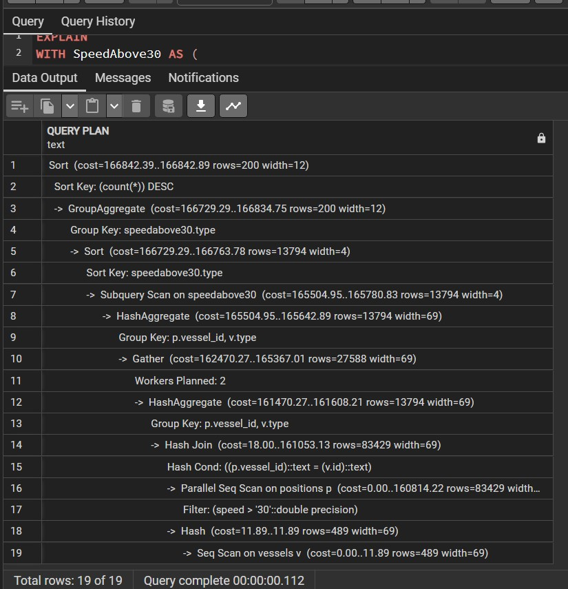
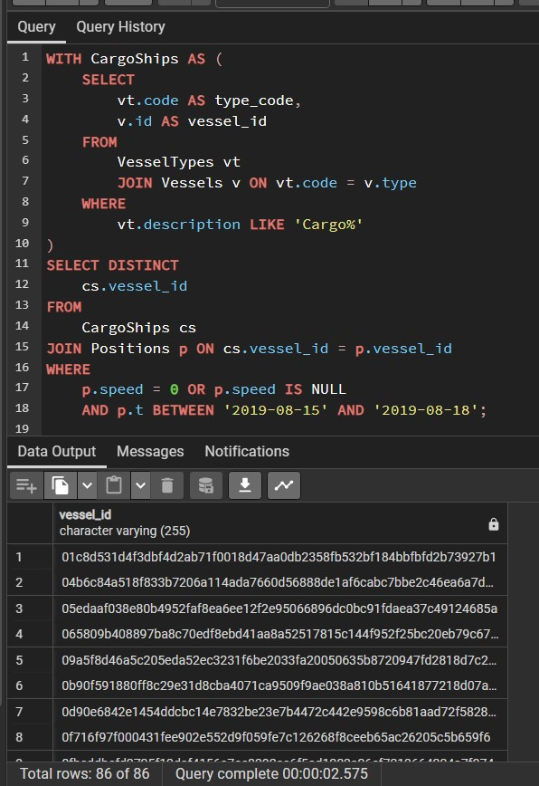
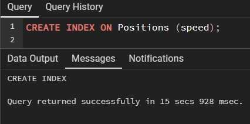
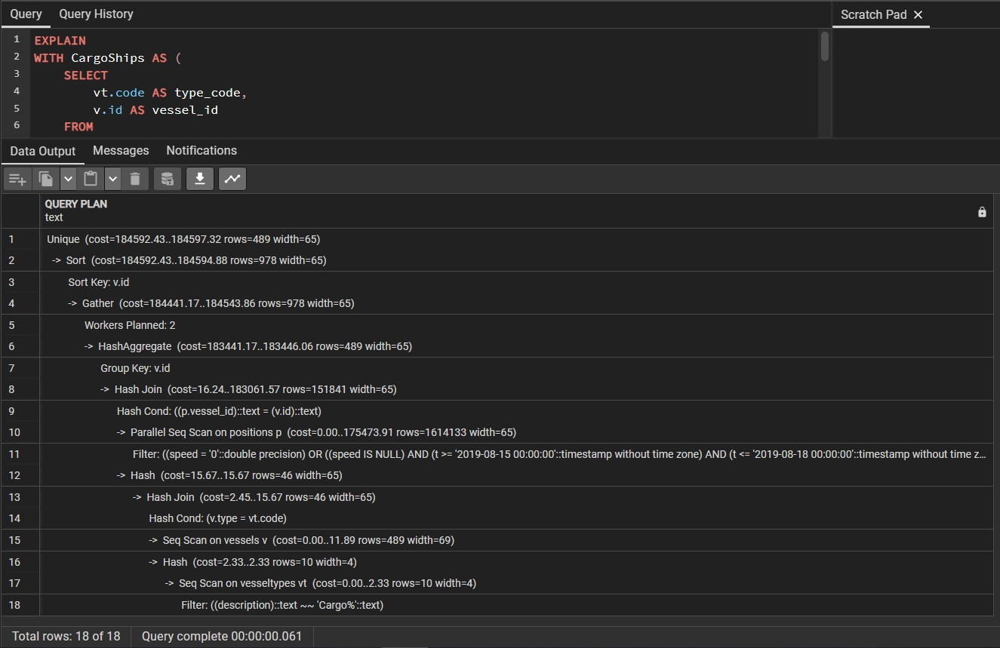
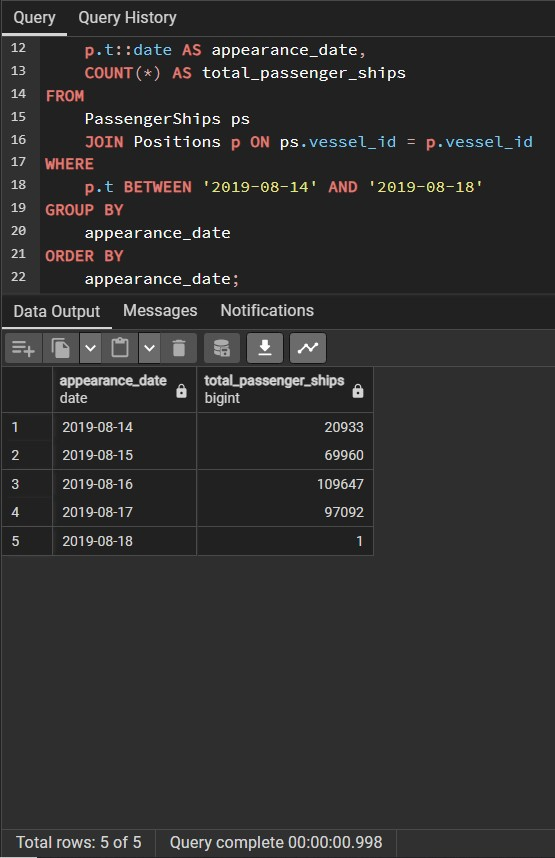

# Vessel Analytics SQL Project
[]()
[]()

This project is a complete SQL-based analytics workflow for vessel movement data. It includes table creation, data loading, query execution, performance tuning using PostgreSQL settings, and indexing strategies.

## 📘 Project Overview

The goal is to analyze vessel movement data using PostgreSQL, focusing on performance improvements via memory tuning, CPU parallelism, and indexing. Each query explores a different aspect of the dataset — from tracking signals to filtering vessel types and speeds.

## 📊 Schema Description

There are three main tables:

- **Vessels**: Basic info about each vessel (e.g., ID, type, flag).
- **Positions**: Timestamped location and speed info. Positions.csv file contains only a tiny portion of the original data.
- **VesselTypes**: Description of vessel types.

## 🛠️ PostgreSQL Features Used

- `COPY ... WITH CSV HEADER` for bulk data import.
- `VACUUM FULL` for statistics refresh.
- `EXPLAIN` for analyzing execution plans.
- `ALTER SYSTEM SET` to increase RAM and worker parallelism.
- `CREATE INDEX` to enhance performance.

## ⚙️ Performance Tuning Steps

The same queries were run in four different stages:

1. **Baseline** — no system tuning.
2. **Increased RAM** — via `work_mem`.
3. **Increased parallel workers** — via `max_parallel_workers_per_gather`.
4. **With indexes** — manually added indexes based on query patterns.

## 🔍 Analytical Queries

| Query | Description |
|-------|-------------|
| Query 1 | Count of unique positions per date |
| Query 2 | Group count of Greek-flagged vessels by type |
| Query 3 | Count of vessels with speed > 30 by type |
| Query 4 | Daily count of passenger ships |
| Query 5a | Anchored cargo ships during 15-18 Aug (speed = 0 or NULL at least once) |
| Query 5b | Stationary cargo ships for full 12-19 Aug period (no movement at all) |

## 📎 How to Run Locally

1. Start PostgreSQL and create your DB.
2. Run all SQL files in `schema/` and `config/`.
3. Copy `.csv` files into the correct tables using `COPY` commands. Alter Copy_With_CSV_Header.sql file according to your needs.
4. Execute queries from `queries/` and analyze performance with `EXPLAIN`.

## 📂 Folder Structure

```
├── README.md
├── schema/
│   ├── Create_Tables.sql
│   ├── Copy_With_CSV_Header.sql
│   ├── Create_Indexes.sql
│   └── Vacuum_Full.sql
├── config/
│   ├── Alter_System_RAM.sql
│   └── Alter_System_Parallel_Workers.sql
├── queries/
│   ├── Query1_Distinct_Signals.sql
│   ├── Query2_Greece_Flag.sql
│   ├── Query3_Speed_Over_30.sql
│   ├── Query4_Passenger_Ships.sql
│   ├── Query5a_Anchored_Cargo.sql
│   └── Query5b_Stationary_Cargo.sql
├── data/
│   ├── Vessels.csv
│   ├── Positions.csv
│   └── VesselTypes.csv
├── screenshots/

```

## 📈 EXPLAIN Plan Observations

- After indexing and tuning, query execution times reduced by up to **99%**.
- Example: Query 5b dropped from 4.6s to 0.2s.
- Index-only scans and faster joins were used post-optimization.

## 🧩 Future Work

- Add Python or Jupyter notebooks for visualizing query results.
- Automate benchmarking with timing scripts.
- Support real-time ingestion (e.g., via Kafka or streaming pipelines).

## 📸 Screenshots

### 🧰 Creation

#### CreateTables


#### AlterDataTypes


#### PopulateP


#### PopulateV


#### PopulateVT


#### VacuumPositions


---


### 🧩 Query 1

#### 1i


#### 1ii


#### 1iii



#### 1iv


#### 1v_a



#### 1v_b

.jpg)


---

### 🧩 Query 2

#### Alter MEM - We will run queries after altering the ammount of RAM used as buffer by SQL
- 

#### 2i


#### 2ii


#### 2iii


#### 2iv


#### 2v_a


#### 2v_b


---


### 🧩 Query 3

#### Indexes
- 
- 
- 

#### Alter CPU - Allow SQL to use more cpu power
- 

#### 3i


#### 3ii


#### 3iii


#### 3iv


#### 3v_a



#### 3v_b


---

### 🧩 Query 4

#### 4i - Index (Created appropriate index for the query)
- 


#### 4ii - Index (Created appropriate index for the query)
- CREATE INDEX idx_vessels_flag ON Vessels (flag); (Screenshot not included)
  


#### 4iii - Index (Created appropriate index for the query)
- 


#### 4iv - Index (Created appropriate index for the query)
- CREATE INDEX ON Positions (t); (Screenshot not included)




#### 4v - Index (Created appropriate index for the query)
- 


#### 4v_b - Same index as above


---

© 2025 – Vessel Analytics SQL Demo by kon-f
